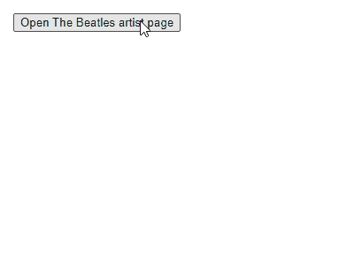
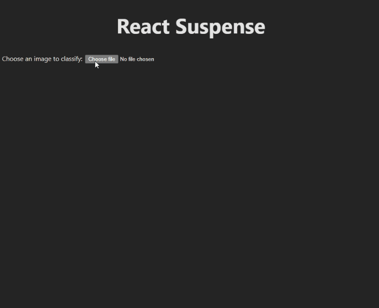
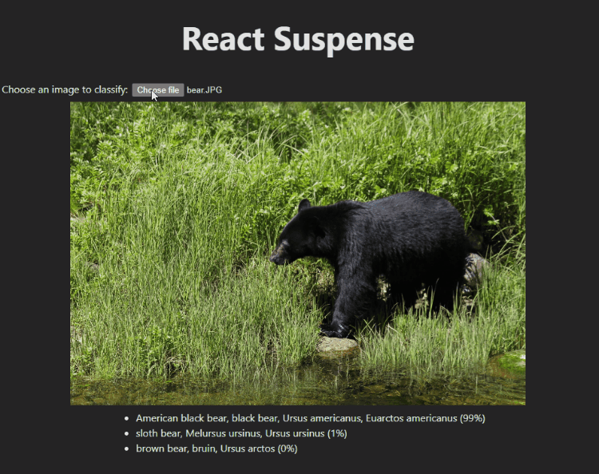
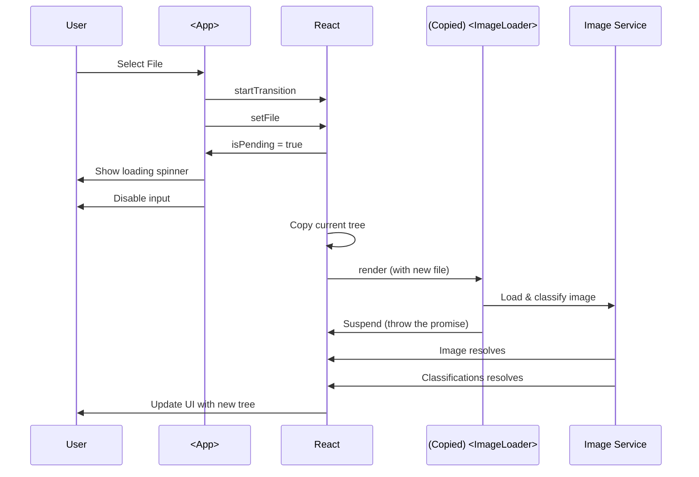

# React, Suspense and Transitions

On a recent project, I tried to use suspense to bind an RxJS Observable to React components.
It was unsuccessful, but in the process I learned some things about React Suspense - which is now "stable" although, not recommended for day to day use.
The experience made me want to dig deeper and find out how, when and _if_ I _can_ use React Suspense in my applications.
Along the way I found transitions, another really cool bit of React API.

In this post I'm going to give you a whistle stop tour of what suspense is, share my findings on the API works and point you at how you might be able to use it in your applications.

I mentioned RxJS, to set the scene, but I'd like to explore Suspense, which is a general API; RxJS will just get in the way. So I'm going to keep it simple and just bind a promise to a React component (just a regular old JavaScript promise).
All you'll need to consume this post is some React and JavaScript.
I've used a sprinkling of TypeScript where it helps, and the example application is in TypeScript, but there's nothing too obscure.

## Why am I bothering?

React
[recommend](https://react.dev/learn/start-a-new-react-project)
that you use React through a framework at the moment, for example Next.js and Remix.
Sort of moving from framework to platform.
So why am I worrying about this at all? Those libraries have this nailed right?

Well... In the applications I have worked on with our clients (high performance, financial dashboards, with custom websocket based data protocols), those frameworks don't feel like a good choice.
Either there's none that's really suitable, or the work required to make it happen is unviable.

In the case I sketched out above, I didn't want to re-write my application to use a framework.
I just wanted to sprinkle in another way to bind existing models into my UI, to unlock the great interactions that Transitions promise.
I wanted at the primitives.

Historically you didn't _need_ a framework to access React's powerful features.
But Suspense and concurrent rendering is a paradigm shift and leveraging it for our clients is both important and, for me at least, not a solved problem.
I fear, the React ecosystem might be moving into a space where it's, accidentally, no longer a general purpose framework.

## What's it all about?

Before I get into the weeds of what suspense is and how to use it, Let's talk about why we want to use it, and what problem it's trying to solve.
It all comes down to Promises and a bit of a history lesson.

React components don't really like asynchrony and they don't play well with promises.
For example, you can't await inside a component, or, directly, inside hooks like `useEffect`.

From a UI's point of view that kind of makes sense - the UI has to do _something_ regardless of whether it's ready.
The user won't quietly `await` the promise.
They want to know the button has been clicked or that the page is loading something.

This causes a problem.
The web _is_ asynchronous.
All those AJAX calls we make to fetch data or dialogues we put up?
All asynchronous.
So how do you join the asynchronous world to a synchronous one?

Historically the answer has been some kind of wrapper hook that tells us the state of the `Promise`.
You'll probably have seen this kind of thing, for example; it's how
[`React-query`](https://github.com/TanStack/query/blob/2.x/docs/src/pages/docs/overview.md#enough-talk-show-me-some-code-already)
works by default, and it's what I fell back to when my efforts with RxJS failed.

Something like this:

```jsx
export const usePromise = (somethingAsync, deps) => {
  const [state, setState] = useState({  status: 'pending' });
  useEffect(() => {
    (async () => {
      setState({ status: 'pending' });
      try {
        const value = await somethingAsync();

        setState({ status: 'fulfilled', value });
      } catch (error) {
        setState({ status: 'rejected', error })
      }
    })();
  }, deps);
}
```

Roughly, use `useState` with an initial value something like  `{ status: 'pending' }` In `useEffect`,  then `await` the promise.
When the promise resolves `setState` to `{ status: 'fulfilled', value }` where value is what the promise resolved to.
If it fails then `setState({ status: 'rejected', error: theError })`.

That lets you use an `if...else` or `switch` in your component to display some feedback to the user.

```jsx
export const AsyncComponent = () => {
  const dataState = usePromise(() => getData(), []);

  if (dataState.status === 'pending') {
    return <Loading />;
  }
  if (dataState.status === 'rejected') {
    throw dataState.error; // let an ErrorBoundary handle it
  }

  return <DisplayYourData data={data} />
}
```

Here `usePromise` takes a method signature like this:

```ts
type getData = () =>  Promise<Data>;
```

which we'd need to `await` to get the data, and changes it into something like this:

```ts
type useData = () =>  PromiseState<Data>;
```

which is Synchronous, so when the data is available, we just have it.
We use `useState` to prompt React when the state of the promise changes and the component needs to re-render.

That works, but it doesn't sit very well.
All those conditional statements don't play well with the
[rules of hooks](https://React.dev/warnings/invalid-hook-call-warning)
for example, and the imperative style feels off when it sits next to the more declarative React APIs like `ErrorBoundary`.

It also encourages the fetch-on-render pattern which degrades User Experience.
When a user takes an action, the UI is whisked away, replaced with a loading spinner, then that too disappears to be replaced with, maybe another loading spinner as the next component down the tree renders, discovers it needs to fetch something and so renders a loading spinner...
If your fetches are quick enough these spinners might flicker up on the screen for just long enough to disconcert.

There's been discussion on this topic for a long time.
For example I remember reading
[this post](https://legacy.Reactjs.org/blog/2019/11/06/building-great-user-experiences-with-concurrent-mode-and-suspense.html).
Generally the consensus is now to aim to fetch-while-you-render.
The user triggers an action, which causes the data to be fetched, then while the data is loading, tell React to draw the new UI.
Hopefully by the time you get there the data has loaded, maybe you don't need to show a loading spinner at all.
The application feels more polished and reassuringly professional.

That's really hard with the tools we have to hand in the React ecosystem though, and there's not been framework support either.
But... the React team have been promising to solve those problems with `Suspense` and "Concurrent Rendering" for years and now it's arrived (kind of).

## So what is Suspense anyway?

[`Suspense`](https://React.dev/reference/React/Suspense) is a way to declaratively tell React what to do when components aren't ready to render yet.

It's been there for a long time already and you might have even used it in conjunction with
[Relay](https://relay.dev/)
or
[`lazy`](https://React.dev/reference/React/lazy).
However the API has always bee declared "experimental" with those two applications of it being the one ones that React officially support.
With the release of React 18 last year, it was announced as "stable".
Although, only to be integrated into
[data fetching frameworks](https://React.dev/blog/2022/03/29/React-v18#suspense-in-data-frameworks).
Still.
Maybe time to take a closer look.

Let's get into that a bit - here it is being used with `lazy`:

```jsx
import { lazy, Suspense } from 'React';
import { Loading } from './loading.js';

const SomeComponent = lazy(() => import('./some-component.js'));

export const Wrapper = () => (
  <Suspense fallback={<Loading/>} >
    <SomeComponent />
  </Suspense>
);
```

`SomeComponent` is declared as "lazy", i.e. we don't want to load _the code_ for that component into the browser _until_ we need it. The `import('./some-component.js')` in the callback passed to `lazy` is a "Dynamic import" which tools like
[Webpack](https://webpack.js.org/guides/code-splitting/#dynamic-imports)
will use to split the code up so you can save on the initial page load.
Have a look a at the links if you want more detail there, but the point is that callback passed into `lazy` returns a `promise` which resolves when the component is ready to be rendered.
In React parlance, `SomeComponent` "suspends" until it is ready to render.

The `Suspense` component declares what to do while we're waiting - `fallback={<Loading/>}`.
It detects that `SomeComponent` has suspended and renders the `Loading` component in it's place (probably a loading spinner).

A neat thing about `Suspense` is you can think of it as a little like a `try...catch` block.
The nearest `Suspense` component in the tree is the one that displays it's fallback, and it doesn't matter what happens in between.
For example:

```jsx
export const Wrapper = () => (
  <Suspense fallback={<OuterLoading />} >
    <SomeComponent />
    <Suspense fallback={<InnerLoading />} >
      <div>
        <SomeOtherComponent />
      </div>
    </Suspense>
  </Suspense>
);
```

If `SomeComponent` suspends then we see `OuterLoading`. If `SomeOtherComponent` suspends then we see `InnerLoading`; working up the tree from `SomeOtherComponent`, that's the next Suspense you come to.
The `div` in between makes no difference, just as with a `try...catch` it doesn't matter how many function calls deeps you go between the `try...catch` and the `throw`. The Error bubbles back up through the call stack until it finds a catch block. IN the same way, when the promise is thrown by a component, it bubbles back up through the component tree until it finds a `Suspense`.

Hopefully that's clear as mud, but the the eagle eyed among you may have noticed that I haven't described the other end of the chain. How do I, as a component author, declare that my component has "suspended"?

Well... that's where things get curious. If you look at the docs for
[Suspense](https://React.dev/reference/React/Suspense)
you won't find it mentioned anywhere.

## Suspend

So here's where we have to go sleuthing. In the docs, while we don't get it spelled out for us, we do find
[example snippets which show how to use `Suspense`](https://React.dev/reference/React/Suspense#usage).
Since these are just examples they are pretty simple, and don't use real data fetches or libraries, so we get the unvarnished truth.

The you can find [this](https://codesandbox.io/s/ymcj43?file=/Albums.js) example in the usage section of the docs. It doesn't do much:



The bit we care about is in `Albums.js`, which contains 2 things - a component and a hook. That looks like this:

```jsx
export default function Albums({ artistId }) {
  const albums = use(fetchData(`/${artistId}/albums`));
  return (
    <ul>
      {albums.map(album => (
        <li key={album.id}>
          {album.title} ({album.year})
        </li>
      ))}
    </ul>
  );
}
```

Fetches some data and then displays it. `fetchData` is pretty noddy - it mimics an AJAX call, and returns a promise of the data.
If you look in
[ArtistPage.js](https://codesandbox.io/s/ymcj43?file=/ArtistPage.js:165-262),
you'll see that `Albums` is wrapped in a `Suspense`. So we're going to see a loading spinner until the data returns.

You'll notice that there's a `use()` wrapping the `fetchData` call, and that we seem to have the raw data returned from that call; there's no `await` or switching logic, this component is kept pretty clean. Use seems to have changed `Promise<Value>` straight to `Value` without having to await it.

[`use`](https://codesandbox.io/s/ymcj43?file=/Albums.js:669-1188) is where the magic happens:

```jsx
function use(promise) {
  if (promise.status === 'fulfilled') {
    return promise.value;
  } else if (promise.status === 'rejected') {
    throw promise.reason;
  } else if (promise.status === 'pending') {
    throw promise;
  } else {
    promise.status = 'pending';
    promise.then(
      result => {
        promise.status = 'fulfilled';
        promise.value = result;
      },
      reason => {
        promise.status = 'rejected';
        promise.reason = reason;
      },
    );
    throw promise;
  }
}
```

If you squint at that and turn your head to the side it kind of looks like a mash-up of the component and hook we had before.
We can see some status monitoring happening with some `if...else` logic, and we can see the promise being `.then`'ed (equivalent of the `await` we had before).
In this case (remember it's an example) the promise is being mutated to store that state, and we're not using `useState` but we basically have the same things gong on as before.

Working down the the branches you can even see similar things, if the promise is `'fulfilled'`, the value is returned synchronously (the component will display it).
If the Promise is `'rejected'`, the `reason` (error) is thrown for an `ErrorBoundary` to catch (not implemented in this example).

Then the new bit - if the promise has a status of `'pending'` then `throw promise`, otherwise (there's no status on the promise, i.e. we haven't seen it before), attach `'pending'`, `await` the promise, then `throw` it.

Throwing the promise turns out to be all you need to do - if React catches a promise it considers the component to have "suspended" and falls back to the nearest `Suspense` components fallback.
It awaits the promise, then attempts to re-render the component.

## Testing the Theory

This is the point I got to with my previous effort to tame Suspense and use it with RxJS. But there was a nuance that isn't obvious here, and tripped me up. So for this post I wanted to go a little further and try the thing out.

I needed a little problem to solve, and settled on a noddy app which uses one of the
[pre-trained TensorFlow.js models, `mobilenet`](https://github.com/tensorflow/tfjs-models/tree/master/mobilenet),
to classify images uploaded from the desktop.
That made everything pretty simple. There's no back end to worry about, but it is an asynchronous operation. We need to `await` the image then the classifications and, so we need to suspend a component.

The [full listings are here](https://github.com/jaybeeuu/React-suspense) and here's a gif of it in action:



I've recorded this erroring so you can see the error boundary getting activated, but once your degrindator has shaken the grebulons out of the system, you see the image as soon as it's uploaded, then the classifications, once they've been calculated.
(MobileNet is right - that's a North American black bear I snapped in Canada.)

There's quite a bit going on here, and I'm not going to talk through the whole app for fear of boring you.
Look at the code if you're interested. For now I'd like to focus on this component:

```jsx
export interface ImageClassificationsProps {
  imageClassifications: Promise<ImageClassification[]>;
}

export const ImageClassifications = ({ imageClassifications }: ImageClassificationsProps): JSX.Element => {
  const resolvedClassifications = usePromise(imageClassifications);

  return (
    <ul>
      {resolvedClassifications.map((classification) => (
        <li key={classification.className}>
          {classification.className} ({Math.round(classification.probability * 100)}%)
        </li>
      ))}
    </ul>
  );
};
```

This is the component you see loading at the bottom of the screen, and displays the classifications. The `imageClassifications` prop is a `promise` of `ImageClassification[]` - that's the data MobileNet returns us. The component uses the promise and then displays the data returned. I've not shown it, but this component is wrapped in a `Suspense` component - so if it suspends we get a loading spinner.
`usePromise` Is how we glue the two together, that's listed [here](https://github.com/jaybeeuu/React-suspense/blob/bf9ffd094ccad973fa617f38816c409c6c3aac8a/src/use-promise.ts).
It's a TypeScript'd and refactored version of the `use` hook shown above so I won't bother showing the listing here - The highlight is if the promise is **pending**, it throws the promise, if its's rejected then it throws the error, and if it's resolved then it synchronously returns the result.

I think this is pretty neat.
It fits really well with the way ErrorBoundaries work for example.
The component consuming my asynchronous data doesn't need to handle any of the other states; loading and errors are handled elsewhere in the app.
There's a down side which is that it's a little magical - it's not obvious from the signature of the hook or the component consuming it, that you need to have it wrapped in a suspense layer.

## The Rub

As you can see, that really is all you need to do to get the component to suspend. There is that nuance I mentioned though.
Initially I had implemented this in what appeared to be a similar fashion to the approach taken by the React doc's example and fetched/asked MobileNet for the classifications inline in the component.

But that looped. The component suspended, then re-rendered, then suspended again, over and over, and MobileNet was being asked for classifications over and over again too. That threw _me_ for a loop until I spotted this
[caveat](https://React.dev/reference/React/Suspense#caveats)
in the React docs:

> React does not preserve any state for renders that got suspended before they were able to mount for the first time. When the component has loaded, React will retry rendering the suspended tree from scratch.

Ahh... so every time my promise resolved, React re-rendered `ImageClassifications` _from_ scratch, defeating my memoisation of the promise, and asks MobileNet again, creating a new Promise instance, which then was put into pending...

Looking back at the example in the docs they cheat (well - it's an example) a bit. The promises `fetchData` makes are cached for the lifetime of the app in a module level `Map` you can see it here in
[data.js](https://codesandbox.io/s/ymcj43?file=/data.js:170-193).

So that gives us a rule to keep in mind when we make components suspend.
You must manage your promises outside of the components that consume them, and you can't use hooks to cache them.
You must cache them yourself.

And here's where we've hit the run.
Having to cache those promises outside of the component that uses them raises all sorts of issues. How long do you cache them for?
How do you key that cache?
How do you know when to clean it up and how do you trigger that?
You can't use `useEffect` tear down for example - I tried it out and if the component suspends then it happens before `useEffects` are triggered, so they are never called.
If you navigated away before the promise resolved then you would never clean up that promise.
Memory leak.

It means you can't just manage the promises directly in the components that consume them, you have to pass the promises around or they have to be persistent somehow outside of React, with life cycles of their own and keys that let you access them.
That's a hard problem to solve in a roll-your-own solution, which might be why the React team have recommended that we use `Suspense` for libraries and haven't publicised the "suspend" end of the API yet.

You can (although it's not quite what I settled on) manage the promise in any component between `Suspense` and the component that suspends; that works fine.
Or you can pass the promises down from the top levels, as I've done(contexts would make this easier in a larger app).
It's only the component that suspended that gets started from scratch.

However... I also noticed some weirdness when I was debugging my app.
That Error I showed is generated when a module label boolean flag is false. The first time you request the classifications, it errors, then sets the flag true, and works from then on.
Weirdly though I wasn't seeing the error at all.
When I dug into it, it turns out that [StrictMode](https://react.dev/reference/react/StrictMode),
was the problem.
Because my effects weren't idempotent (running them more than once has no impact on how they function), I was getting strange results.
Strict mode means that all effects get a sort of "warm up" cycle during mount, to help you shake out bugs which can show up in concurrent rendering scenarios.
It's really important to have it on, if you are.

I think this kills the pass promises down business and means you need to write a separate, stateful, service, which manages the life cycle of the promises...

In trying to solve that problem mentally I think I'm converging on something like
[`React-query`](https://tanstack.com/query/latest)
that I mentioned earlier.
It looks like it _might_ solve these problems, allowing you to create a "query" with an arbitrary async function, and call it within your component and it does have an experimental
["suspense mode"](https://tanstack.com/query/latest/docs/react/community/suspensive-react-query).
So long as your "key" is stable, it will take care of caching and GC if the query get's abandoned.
Further experimentation is needed perhaps.

Still - with some compromise, effort, an import or combinations thereof, we have some way to simply integrate asynchronous operations in to React applications, and it leaves the application code completely unaware of the asynchrony, and devoid of logic handling it. So that's nice.

## The Next Step

There was another part of the React 18 announcement that went along with the suspense "release". That's the
["Transitions"](https://React.dev/blog/2022/03/29/React-v18#new-feature-transitions).
This is pretty neat. Essentially, wrap the change that will cause a component to suspend, and you're UI isn't whisked away, it remains until the new tree is ready to render.

Check this out:



This time, we start where we left off - we've just loaded and classified the bear image. Is select an image of a
[Pacific White-Sided Dolphin](https://en.wikipedia.org/wiki/Pacific_white-sided_dolphin).

THis time though, when the open file dialogue closes, we still see the bear. There's a little loading spinner added up top, and the choose file button has been disabled.
Then after a little delay we get the image and the classifications all on one go. (MobileNet is confused this time, but, to be fair; pacific white-sided dolphins do bear a passing resemblance to orca and I'll bet weren't in the training data.)

The difference in the user experience is stark. Must be a lot of very complex code right? Not a bit - it's the exactly the same.

What's happened?

The trick here is in the
[`onChange` on the file input in `App`](https://github.com/jaybeeuu/React-suspense/blob/main/src/app/App.tsx#L20-L30):

```tsx
export const App = (): JSX.Element => {
  const [file, setFile] = useState<File | null>();
  const [isPending, startTransition] = useTransition();

  return (
    <>
      <header className={styles.header}>
        <h1>React Suspense</h1>
      </header>

      <main className={styles.main}>
        <label>
          Choose an image to classify:
          <input
            disabled={isPending}
            type="file"
            onChange={(e) => {
              startTransition(() => {
                void getMobileNet(); // get MobileNet loading, but don't wait for it.
                setFile(e.currentTarget.files?.item(0));
              });
            }}
            accept="image/*"
          />
          {isPending ? <LoadingSpinner size={"small"} /> : null}
        </label>
        {file ? (
          <ImageLoader file={file} />
        ) : null}
      </main>
    </>
  );
};
```

The state change that causes the app to change the image we're interested in is `setFile(e.currentTarget.files?.item(0))` (see the `useState` call up top.).
You'll notice that that is wrapped in a call to `startTransition` which, in turn, comes from a hook -
[`useTransition`](https://React.dev/reference/React/useTransition).

`startTransition` marks the state change for React, so it knows we're about to change the UI dramatically. Rather than change what the user sees immediately, React copies the tree, passes the new state into the copy (in our case `file` goes into `ImageLoader`, which triggers the file load and classification), then starts rendering the components. All the while, React continues to maintain the original UI; passing us back `true` on `isPending` so we can  the user know something is happening (mini loading spinner & disable the input).

Only when the new tree is ready will React actually commit it to the UI and change what the user sees, in our case once the image has loaded and the classifications have returned.

That looks something like this:



This is concurrent rendering in action (React's own version of multi-universe theory).

And this is the exact same code as the original user flow!
I promise!
Can you imagine trying to do that without using suspense?
I've tried; it's hard. You have to know things about the tree you're moving too, like all of the data it might need to request.

## Conclusions

I feel that suspense is a powerful feature, and will unlock a lot of cool things we can do with React, especially when used in conjunction with `useTransition`.
Once library authors catchup a bit, or it becomes further democratised I'm sure it could help us in building awesome UX.

However, I'm left wondering if the team haven't gone a bit too far
[down the rabbit hole here](https://overReacted.io/algebraic-effects-for-the-rest-of-us/),
and done something that was a bit too clever for it's own good.
Maybe it would have just been better to let us use the features built into the language and
[allow components be asynchronous](https://crank.js.org/)?
Sometimes, if it's hard to use; it's because you're doing it wrong.
I mentioned up top that the React framework has moved to a platform and expect us now to develop with it through frameworks.
And this API is definitely an example of that.
It doesn't seem there's a good application developer level solution here.

For me this feels like a bad sign.
We're at the mercy of the opinions and target solutions the frameworks and libraries are aimed at, and how they've integrated suspense.
Fine, but that doesn't work in all cases.
Does this mean React is no longer a good choice for this kind of application?
And that we should be looking elsewhere in the web ecosystem?
Maybe I just need to look deeper into the ecosystem a bit more or it needs to catchup a bit.
I'm not sure, but it's a thing to think about.
